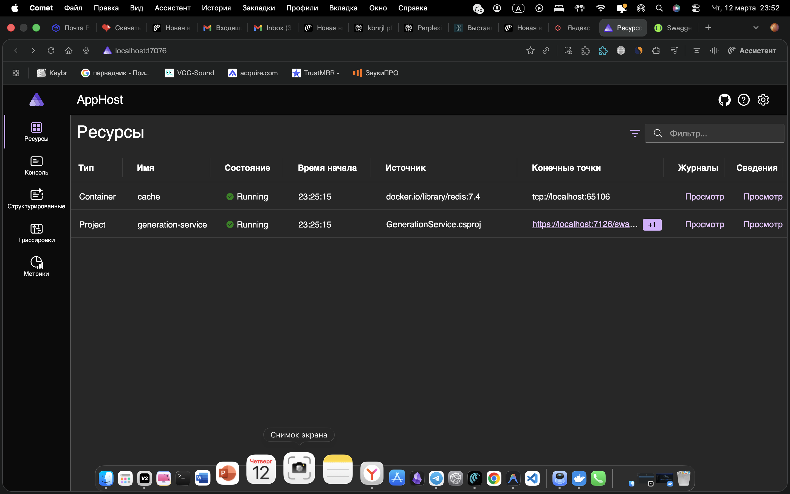
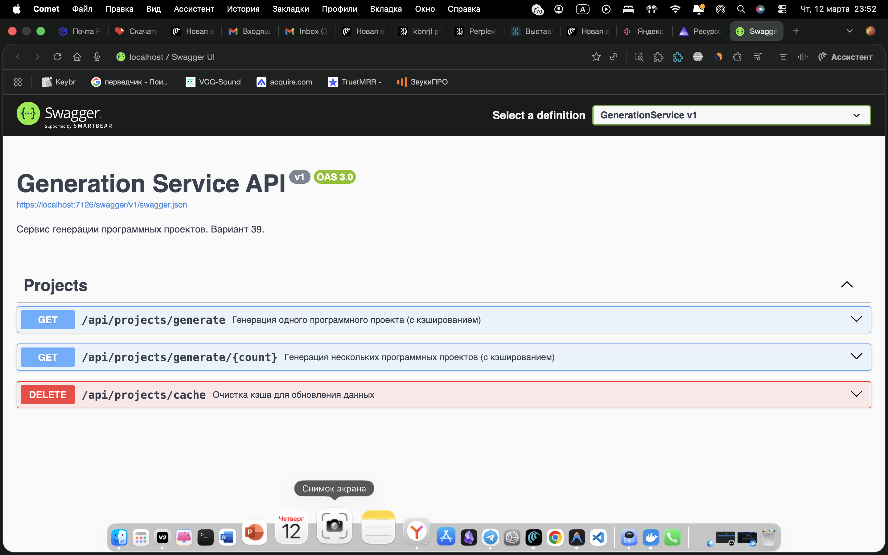
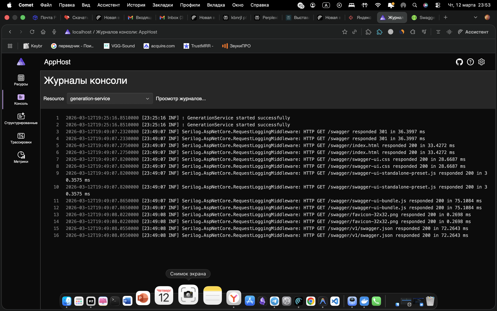

# Лабораторная работа №1 — Кэширование

**Студент:** Панкеев Глеб  
**Группа:** 6512  
**Вариант:** 39  
**Предметная область:** Программный проект  

---

## Цель

Реализация сервиса генерации программных проектов с кэшированием ответов через Redis и структурным логированием.

## Задачи

- [x] Реализовать сервис генерации данных на основе **Bogus**
- [x] Реализовать кэширование при помощи **IDistributedCache** и **Redis**
- [x] Реализовать структурное логирование через **Serilog**
- [x] Настроить оркестрацию **Aspire**

---

## Структура проекта

```
cloud-development/
├── AppHost/                   # .NET Aspire — оркестрация (Redis + GenerationService)
├── ServiceDefaults/           # Общие настройки Aspire (OpenTelemetry, health checks)
├── GenerationService/         # Web API — генерация и кэширование
│   ├── Models/
│   │   └── SoftwareProject.cs         # Модель «Программный проект»
│   ├── Services/
│   │   └── ProjectGeneratorService.cs # Генерация данных через Bogus
│   └── Endpoints/
│       └── ProjectsEndpoints.cs       # REST API с кэшированием
└── Client.Wasm/               # Blazor WebAssembly клиент
```

---

## Описание реализации

### Модель данных — `SoftwareProject`

Предметная область варианта 39 — **Программный проект**. Модель содержит:

| Поле | Тип | Описание |
|------|-----|---------|
| `Id` | `Guid` | Уникальный идентификатор |
| `Name` | `string` | Название проекта |
| `Description` | `string` | Описание |
| `ProgrammingLanguage` | `string` | Язык программирования |
| `RepositoryUrl` | `string` | URL репозитория |
| `License` | `string` | Лицензия (MIT, Apache, GPL...) |
| `Status` | `string` | Статус (Active, Completed...) |
| `TeamSize` | `int` | Размер команды |
| `StartDate` | `DateTime` | Дата начала |
| `EndDate` | `DateTime?` | Дата завершения (опционально) |
| `StarsCount` | `int` | Количество звёзд |
| `OpenIssuesCount` | `int` | Открытые задачи |
| `LeadDeveloper` | `string` | Ведущий разработчик |

### Генерация данных — Bogus

Сервис `ProjectGeneratorService` использует библиотеку **Bogus** для генерации реалистичных данных о программных проектах. Поддерживает генерацию одного объекта и списка.

### Кэширование — IDistributedCache + Redis

Логика кэширования реализована в `ProjectsEndpoints`:

```
Запрос → Проверка Redis → Cache HIT → return cached data
                       ↓ Cache MISS
                   Bogus генерация → Запись в Redis (TTL = 5 мин) → return data
```

Ключи кэша:
- `project:single` — один проект
- `projects:list:{count}` — список проектов

### Логирование — Serilog

Структурное логирование с шаблоном:
```
[HH:mm:ss LVL] {SourceContext}: {Message}
```

Фиксируются события:
- `Cache HIT for key: {CacheKey}` — данные получены из Redis
- `Cache MISS for key: {CacheKey}. Generating...` — генерация новых данных
- `Generated project: {Name} [{Language}]` — детали сгенерированного объекта
- HTTP-запросы через `UseSerilogRequestLogging`

---

## API Endpoints

| Метод | URL | Описание |
|-------|-----|---------|
| `GET` | `/api/projects/generate` | Генерация одного проекта (с кэшем) |
| `GET` | `/api/projects/generate/{count}` | Генерация `count` проектов (с кэшем) |
| `DELETE` | `/api/projects/cache` | Очистка кэша |

Swagger UI доступен по адресу: `https://localhost:{port}/swagger`

---

## Оркестрация — .NET Aspire

AppHost настраивает и запускает:
1. **Redis** — автоматически в Docker-контейнере (`redis:7.4`)
2. **GenerationService** — с внедрённой ссылкой на Redis

```csharp
var cache = builder.AddRedis("cache");

builder.AddProject<Projects.GenerationService>("generation-service")
    .WithReference(cache);
```

---

## Скриншоты

### Aspire Dashboard — ресурсы запущены


### Swagger UI — документация API


### Логи — Cache MISS и Cache HIT


---

## Запуск

```bash
# 1. Убедитесь что Docker запущен

# 2. Клонируйте и перейдите в директорию
git clone <repo-url>
cd cloud-development

# 3. Восстановите пакеты
dotnet restore CloudDevelopment.sln

# 4. Запустите через Aspire
dotnet run --project AppHost
```

Aspire Dashboard откроется на `https://localhost:{port}`.
