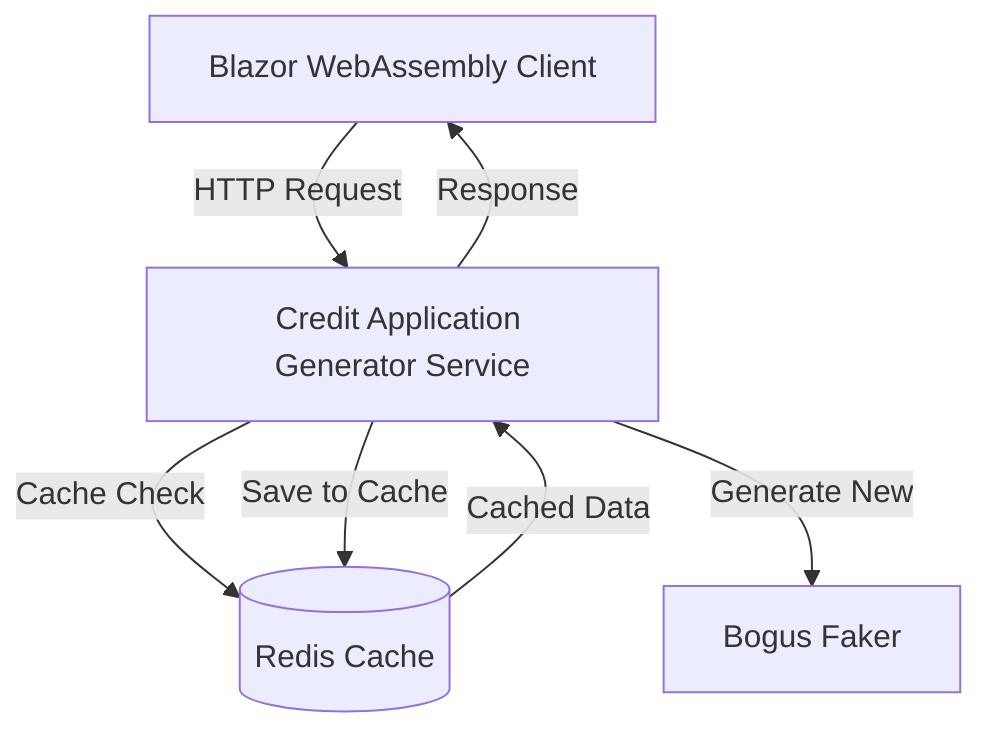

# Генератор "Кредитной заявки"

> **Вариант #4** "Кредитная заявка"  
> **Студент:** Дмитрий Горшенин, группа 6511  
> **Репозиторий:** [github.com/dmgorshenin/cloud-development](https://github.com/dmgorshenin/cloud-development)

## 📝 Описание задачи

Реализация микросервиса для генерации заявок на кредит с поддержкой кэширования с использованием оркестровки .NET Aspire.

### Цели
- Реализация сервиса генерации контрактов на основе Bogus
- Реализация кэширования с использованием IDistributedCache и Redis
- Реализация структурированного логирования для сервиса генерации
- Настройка оркестрации Aspire

### Детали варианта
**Вариант №4 - Кредитная заявка**

Сервис генерирует данные заявки на кредит со следующими характеристиками:
- Типы кредитов: Потребительский кредит, Ипотека, Автокредит, Образовательный кредит, Кредит на рефинансирование
- Процентные ставки: минимум 16% (ставка ЦБ РФ на момент создания лабораторной)
- Статусы заявки: Новая, В процессе, Одобрена, Отклонена
- Автоматический расчет сумм одобрения и дат принятия решения на основе статуса


## 🏗️ Архитектура

Решение состоит из следующих проектов:

```
cloud-development/
├── CreditApplication.Generator/ # Сервис генерации заявок на кредит
│ ├── Services/
│ │ ├── CreditApplicationGenerator.cs # Генератор на основе Bogus
│ │ └── CreditApplicationService.cs # Сервис с кэшированием
│ └── Models/
│   └── CreditApplicationModel.cs # Модель данных кредитной заявки
├── CreditApplication.AppHost/ # Оркестрация .NET Aspire
├── CreditApplication.ServiceDefaults/ # Конфигурации общих сервисов (Serilog, OpenTelemetry)
└── Client.Wasm/ # Клиент Blazor WebAssembly
    └── Components/
       ├── DataCard.razor # Просмотрщик кредитных заявок
       └── StudentCard.razor # Отображение информации о лаборатории
```

### Архитектурная диаграмма



### Скриншоты


