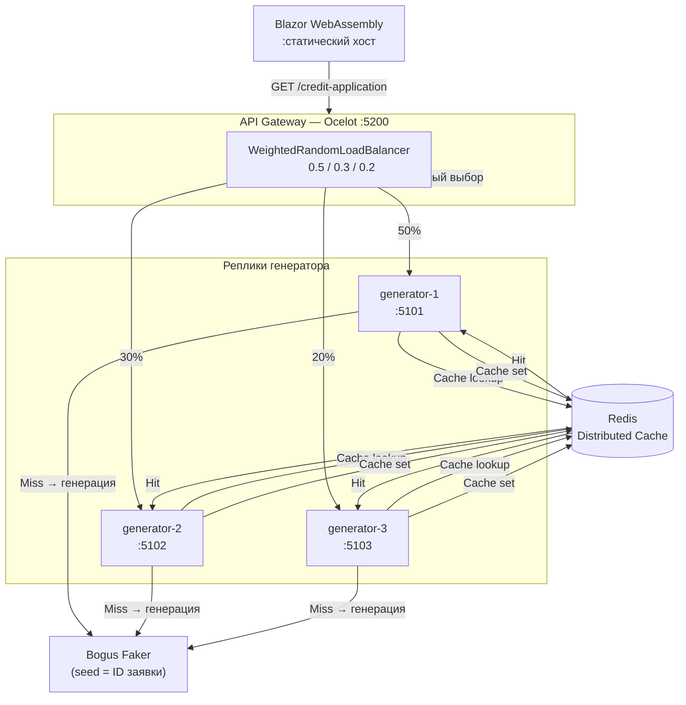

# Генератор "Кредитной заявки"

> **Вариант #4** "Кредитная заявка"  
> **Студент:** Дмитрий Горшенин, группа 6511  
> **Репозиторий:** [github.com/dmgorshenin/cloud-development](https://github.com/dmgorshenin/cloud-development)

## 📋 Лабораторные работы

| Лаб | Ветка | Описание |
|-----|-------|----------|
| 1 | `Lab1` | Генератор + Redis + Blazor + Aspire |
| 2 | `Lab2` | + API-шлюз Ocelot + 3 реплики + взвешенный балансировщик |

---

## 📝 Лабораторная работа №1

Реализация микросервиса генерации заявок на кредит с кэшированием на базе .NET Aspire.

### Цели
- Реализация генератора данных на основе **Bogus** с детерминированным seed
- Кэширование результатов с помощью **IDistributedCache** и **Redis**
- Структурированное логирование через **Serilog**
- Трассировка и метрики через **OpenTelemetry**
- Оркестрация сервисов через **.NET Aspire**

### Детали варианта
**Вариант №4 — Кредитная заявка**

| Параметр | Значения |
|----------|----------|
| Типы кредита | Потребительский, Ипотека, Автокредит, Образовательный, Рефинансирование |
| Процентная ставка | от 16% (ключевая ставка ЦБ РФ) до 35% |
| Сумма | от 50 000 до 10 000 000 ₽ |
| Срок | от 6 до 360 месяцев |
| Статусы | Новая, В обработке, Одобрена, Отклонена |
| Автовычисление | Сумма одобрения и дата решения — на основе статуса |

---

## 🚀 Лабораторная работа №2

Расширение решения паттернами **API Gateway** и **горизонтального масштабирования**.

### Цели
- Добавление **API-шлюза** на основе **Ocelot**
- Запуск **трёх реплик** сервиса генерации через Aspire
- Реализация **взвешенного случайного балансировщика нагрузки** (`WeightedRandomLoadBalancer`)
- Вынос общих настроек (**CORS**, **Serilog**, **OpenTelemetry**) в `ServiceDefaults`
- Автоматическое разрешение адресов реплик через **Aspire Service Discovery**

### Что нового по сравнению с Лаб. 1

| | Лаб. 1 | Лаб. 2 |
|-|--------|--------|
| Экземпляры генератора | 1 | 3 (generator-1/2/3) |
| Клиент обращается к | Generator напрямую | Gateway (`:5200`) |
| Балансировка | — | Взвешенный случайный выбор |
| API Gateway | — | Ocelot |
| CORS | В каждом сервисе отдельно | Централизованно в `ServiceDefaults` |
| Redis Commander | Всегда | Только в Development |

---

## 🏗️ Архитектура

### Структура решения

```
cloud-development/
├── CreditApplication.AppHost/              # Оркестрация .NET Aspire
│   └── Program.cs                          # 3 реплики генератора + шлюз + Redis
│
├── CreditApplication.Gateway/              # API-шлюз (Ocelot)
│   ├── LoadBalancing/
│   │   └── WeightedRandomLoadBalancer.cs   # Взвешенный случайный балансировщик
│   ├── ocelot.json                         # Маршруты и веса реплик
│   └── Program.cs                          # Настройка Ocelot + health checks
│
├── CreditApplication.Generator/            # Сервис генерации (запускается в 3 репликах)
│   ├── Services/
│   │   ├── CreditApplicationGenerator.cs   # Генератор на основе Bogus
│   │   └── CreditApplicationService.cs     # Кэш-aside логика (Redis)
│   └── Models/
│       └── CreditApplicationModel.cs       # Модель кредитной заявки
│
├── CreditApplication.ServiceDefaults/      # Общие расширения всех сервисов
│   └── Extensions.cs                       # Serilog, OpenTelemetry, CORS, Health checks
│
└── Client.Wasm/                            # Клиент Blazor WebAssembly
    └── Components/
        ├── DataCard.razor                  # Просмотр кредитных заявок
        └── StudentCard.razor               # Информация о лабораторной работе
```

### Архитектурная диаграмма



### Порты сервисов

| Сервис | Порт | Описание |
|--------|------|----------|
| `gateway` | 5200 | Единая точка входа для клиента |
| `generator-1` | 5101 | Реплика генератора (вес 0.5) |
| `generator-2` | 5102 | Реплика генератора (вес 0.3) |
| `generator-3` | 5103 | Реплика генератора (вес 0.2) |
| `redis` | 6379 | Кэш |
| Redis Commander | 8081 | Веб-UI Redis (только Development) |

---

## ⚙️ Ключевые технические решения

### Взвешенный балансировщик нагрузки

Реализован `WeightedRandomLoadBalancer : ILoadBalancer` для Ocelot. Веса настраиваются в `ocelot.json`:

```json
"ReplicaWeights": {
  "localhost:5101": 0.5,
  "localhost:5102": 0.3,
  "localhost:5103": 0.2
}
```

Алгоритм: кумулятивное суммирование + `Random.Shared.NextDouble()`. При нулевой сумме весов — равномерный случайный выбор.

### Aspire Service Discovery

При запуске через Aspire шлюз автоматически получает адреса реплик из переменных окружения (`services:{name}:http:0`) и подставляет их в конфигурацию Ocelot через `AddInMemoryCollection`, не затрагивая `ocelot.json`.

## 🛠️ Используемые технологии

| Технология | Версия | Назначение |
|------------|--------|-----------|
| .NET Aspire | 9.5.2 | Оркестрация, service discovery, dashboard |
| Ocelot | 23.3.3 | API Gateway, маршрутизация |
| Bogus | latest | Детерминированная генерация данных |
| Redis | latest | Распределённый кэш |
| Serilog | latest | Структурированное логирование |
| OpenTelemetry | latest | Трассировка и метрики |
| Blazor WebAssembly | .NET 8 | Веб-клиент |

---

### Скриншоты


