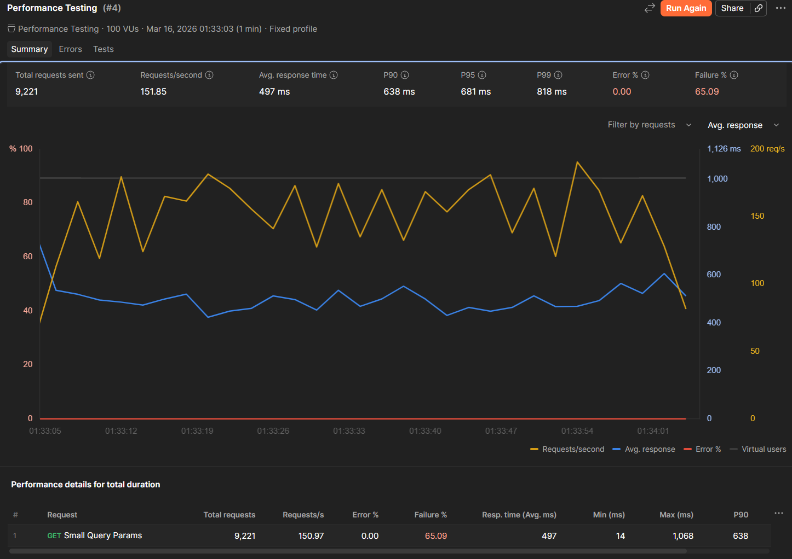
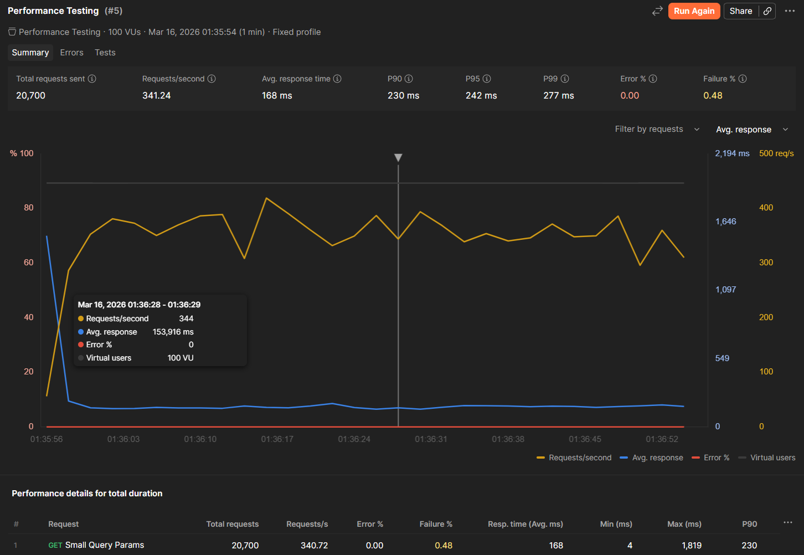

# Современные технологии разработки программного обеспечения
[Таблица с успеваемостью](https://docs.google.com/spreadsheets/d/1an43o-iqlq4V_kDtkr_y7DC221hY9qdhGPrpII27sH8/edit?usp=sharing)

## Задание
### Цель
Реализация проекта микросервисного бекенда.

### Задачи
* Реализация межсервисной коммуникации,
* Изучение архитектурных паттернов,
* Изучение работы со средствами оркестрации на примере .NET Aspire,
* Повторение основ работы с системами контроля версий,
* Интеграционное тестирование.

### Лабораторная работа №1

«Кэширование» - Реализация сервиса генерации контрактов, кэширование его ответов

  
В рамках первой лабораторной работы необходимо:
* Реализовать сервис генерации контрактов на основе Bogus,
* Реализовать кеширование при помощи IDistributedCache и Redis,
* Реализовать структурное логирование сервиса генерации,
* Настроить оркестрацию Aspire. 

- Задание. Общая часть
**Обязательно**:
* Реализация серверной части на [.NET 8](https://learn.microsoft.com/ru-ru/dotnet/core/whats-new/dotnet-8/overview).
* Оркестрация проектов при помощи [.NET Aspire](https://learn.microsoft.com/ru-ru/dotnet/aspire/get-started/aspire-overview).
* Реализация сервиса генерации данных при помощи [Bogus](https://github.com/bchavez/Bogus).
* Реализация тестов с использованием [xUnit](https://xunit.net/?tabs=cs).
* Создание минимальной документации к проекту: страница на GitHub с информацией о задании, скриншоты приложения и прочая информация.

#### Вариант №3 
| Доменная область | Балансировка | Брокер | Хостинг S3 |
| --- | --- | --- | --- |
| Транспортное средство | Query Based | SNS | Localstack |

 «Транспортное средство» 

Необходимо сгенерировать информацию о транспортном средстве со следующими характеристиками:

| №  | Название                          | Тип данных |
|---:|-----------------------------------|-----------|
| 1  | Идентификатор в системе           | int       |
| 2  | VIN-номер                         | string    |
| 3  | Производитель                     | string    |
| 4  | Модель                            | string    |
| 5  | Год выпуска                       | int       |
| 6  | Тип корпуса                       | string    |
| 7  | Тип топлива                       | string    |
| 8  | Цвет корпуса                      | string    |
| 9  | Пробег                            | double    |
| 10 | Дата последнего техобслуживания   | DateOnly  |

Комментарии к характеристикам:
- VIN-номер берется из раздела Vehicle
- Производитель берется из раздела Vehicle
- Модель берется из раздела Vehicle
- Тип корпуса берется из раздела Vehicle
- Тип топлива берется из раздела Vehicle
- Цвет корпуса берется из раздела Commerse
- Год выпуска не может быть позже текущего
- Пробег не может быть меньше нуля
- Дата последнего техобслуживания не может быть раньше года выпуска

### Тут будут типа скриншоты приложения типа:

#### Тесты 100 пользователей 1 минута:

##### Без Redis 
- c рандомными seed:

avg 235ms
- с одинаковым seed:

avg 231ms

##### C Redis
- Одинаковый seed:

avg 163ms

- абсолютно рандомный seed:

avg 497

- рандомный seed от 1 до 100:

avg 168ms

Первый запрос(данных нет в Redis):
 
19-20ms

Второй(и более) запрос(данные лежат в Redis):

9-11ms
