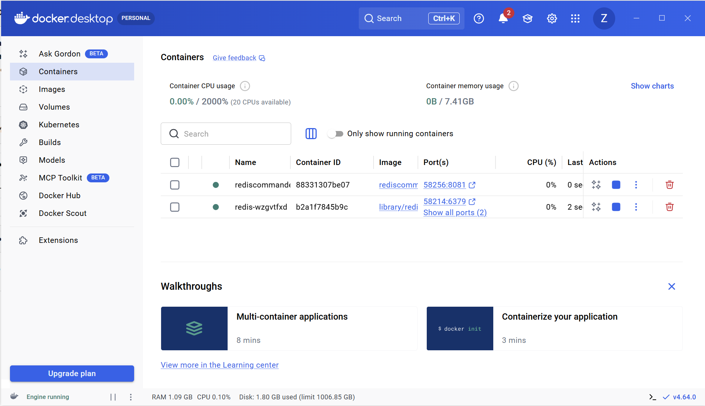
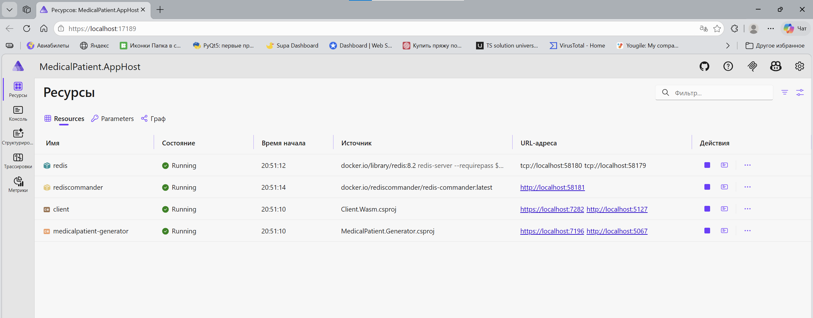
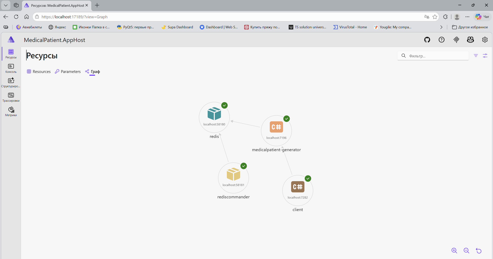
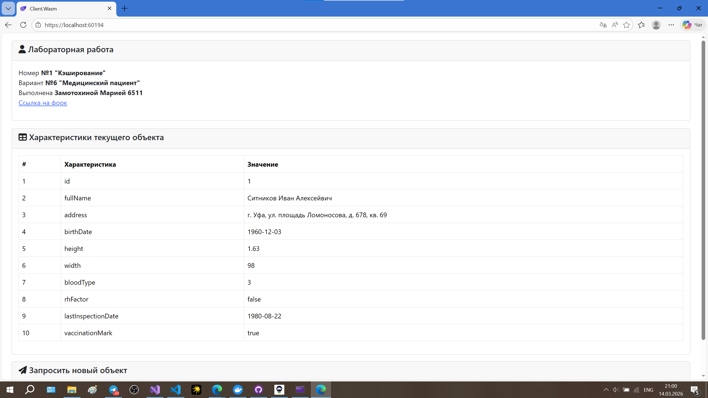
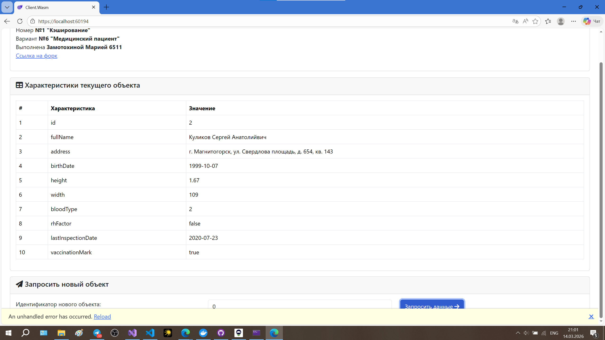
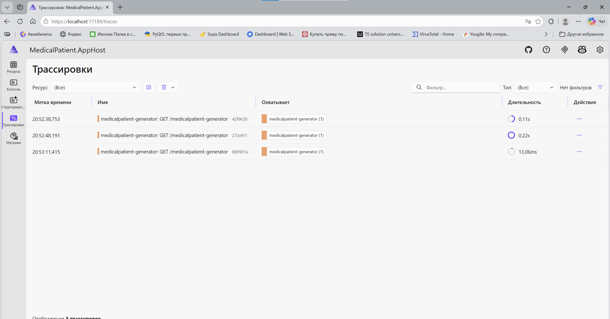

# Современные технологии разработки программного обеспечения

### Вариант №6:
- Доменная область: Медицинский пациент
- Балансировка: Weighted Round Robin
- Брокер: SQS
- Хостинг S3: Localstack

## Лабораторная работа №1 - кеширование

В рамках первой лабораторной работы необходимо:
* Реализовать сервис генерации контрактов на основе Bogus,
* Реализовать кеширование при помощи IDistributedCache и Redis,
* Реализовать структурное логирование сервиса генерации,
* Настроить оркестрацию Aspire. 
  
### Реализовано:
- Добавлен сервис генерации сотрудников с кешированием
- Выполнена оркестрация Aspire
- Логирование основных действий

### Скриншоты работащего приложения

  

    Поднятые контейнеры
  

  

  

  

  

    Пример полученного сотрудника
  

  

  При попытке получить пациента с ID = 0 возникает ошибка:

  

  

    Трассировки и демонстрация работы кэширования
  

  

