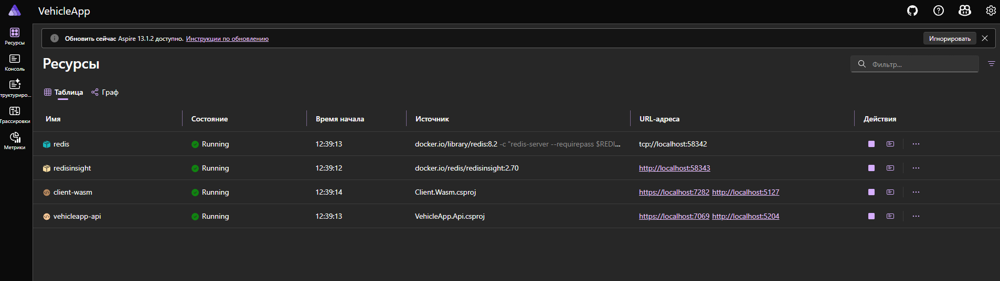
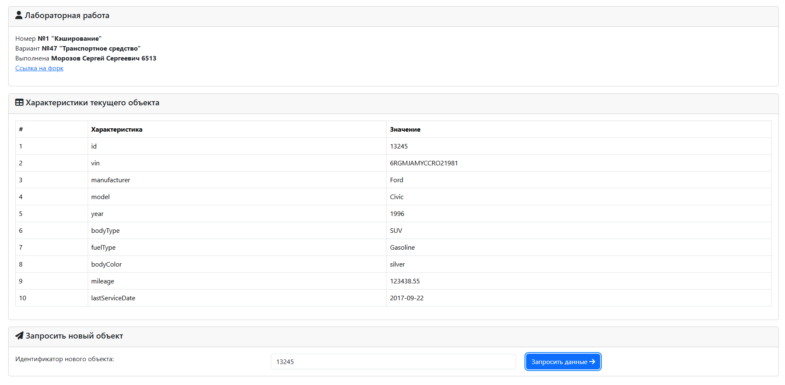

# Лабораторные работы — «Облачная разработка»

## Вариант 47 — «Транспортное средство»

---

## Лабораторная работа №1 — «Кэширование»

### Описание

Реализован микросервисный бэкенд для генерации данных о транспортных средствах с кэшированием в Redis и оркестрацией через .NET Aspire.

### Что реализовано

- Сервис генерации данных о транспортных средствах на основе Bogus
- Кэширование ответов при помощи `IDistributedCache` и Redis
- Структурное логирование сервиса генерации
- Оркестрация всех компонентов через .NET Aspire
- Blazor WebAssembly клиент для отображения данных

---

## Лабораторная работа №2 — «Балансировка нагрузки»

### Описание

Реализован API Gateway на основе Ocelot с кастомным алгоритмом балансировки нагрузки **Query Based**.

### Что реализовано

- Запуск 7 реплик сервиса генерации через .NET Aspire (порты 5000–5006)
- API Gateway на Ocelot с маршрутизацией `/vehicles` → `/api/vehicles`
- Кастомный балансировщик `QueryBased` — реплика выбирается по формуле `id % N`, где N — число реплик

### Алгоритм балансировки

Из query-параметра `id` вычисляется остаток от деления на количество реплик. Результат — индекс реплики, обрабатывающей запрос.

---

## Лабораторная работа №3 — «Брокер сообщений и объектное хранилище»

### Описание

Расширен пайплайн генерации ТС: после генерации нового ТС сервис публикует его в брокер сообщений, отдельный файловый сервис забирает сообщение и кладёт JSON в объектное хранилище.

Вариант **47** — **SNS + Minio**: брокер сообщений AWS SNS (эмулируется через LocalStack), хранилище — Minio с S3-совместимым API.

### Что реализовано

- **`VehicleApp.Api`** — при генерации нового ТС публикует JSON в SNS-топик (`SnsVehiclePublisher`). Если ТС взято из Redis — публикации нет.
- **`File.Service`** — новый сервис:
  - `SnsSubscriptionService` подписывает эндпоинт `http://host.docker.internal:5280/api/sns` на SNS-топик при старте;
  - `SnsWebhookController` принимает `SubscriptionConfirmation` и `Notification`;
  - `MinioS3Service` создаёт бакет `vehicle-bucket` и складывает ТС под ключом `vehicle_{id}.json`;
  - `S3Controller` отдаёт список ключей (`GET /api/s3`) и содержимое файла (`GET /api/s3/{key}`).
- **`VehicleApp.AppHost`** — добавлены контейнеры LocalStack (SNS, порт 4566) и Minio, CloudFormation-шаблон `CloudFormation/vehicle-sns.yaml` создаёт SNS-топик `vehicle-topic`, ARN пробрасывается в реплики API и в File.Service через `AWS:Resources:SNSTopicArn`.
- **`VehicleApp.AppHost.Tests`** — интеграционный тест `GatewayRequest_PublishesVehicleToMinio`: стучится в **гейтвей** с конкретным `id`, затем поллит `/api/s3/vehicle_{id}.json` в File.Service и сверяет содержимое с ответом гейтвея.

### Стек технологий (дополнение)

- LocalStack 2.x (эмуляция AWS SNS)
- AWSSDK.SimpleNotificationService
- Minio (.NET клиент `CommunityToolkit.Aspire.Minio.Client`)
- Aspire.Hosting CloudFormation (создание SNS-топика)

## Стек технологий

- .NET 8
- .NET Aspire 9.5
- Bogus — генерация данных
- Redis — распределённое кэширование
- RedisInsight — визуализация данных в Redis
- Blazor WebAssembly — клиентское приложение
- OpenTelemetry — метрики, трейсинг, логирование

## Структура проекта

| Проект | Описание |
|---|---|
| `VehicleApp.Api` | API-сервис генерации транспортных средств (7 реплик), публикует ТС в SNS |
| `VehicleApp.Gateway` | API Gateway на Ocelot с балансировкой Query Based |
| `File.Service` | Подписчик SNS, сохраняет JSON в Minio |
| `VehicleApp.AppHost` | Aspire-оркестратор (Redis + LocalStack + Minio + сервисы) |
| `VehicleApp.AppHost.Tests` | Интеграционные тесты пайплайна |
| `VehicleApp.ServiceDefaults` | Общие настройки сервисов (OpenTelemetry, health checks) |
| `Client.Wasm` | Blazor WebAssembly клиент |

## Характеристики транспортного средства

| № | Название | Тип данных | Источник Bogus |
|---|---|---|---|
| 1 | Идентификатор в системе | `int` | Параметр запроса |
| 2 | VIN-номер | `string` | `Vehicle.Vin()` |
| 3 | Производитель | `string` | `Vehicle.Manufacturer()` |
| 4 | Модель | `string` | `Vehicle.Model()` |
| 5 | Год выпуска | `int` | `Random.Int(1980, текущий год)` |
| 6 | Тип корпуса | `string` | `Vehicle.Type()` |
| 7 | Тип топлива | `string` | `Vehicle.Fuel()` |
| 8 | Цвет корпуса | `string` | `Commerce.Color()` |
| 9 | Пробег (км) | `double` | `Random.Double(0, 300000)` |
| 10 | Дата последнего ТО | `DateOnly` | `Date.Between(год выпуска, сегодня)` |

## Скриншоты

### Aspire Dashboard

### Клиент

