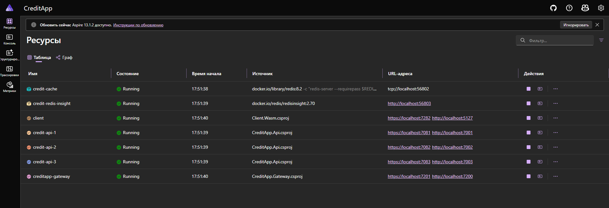
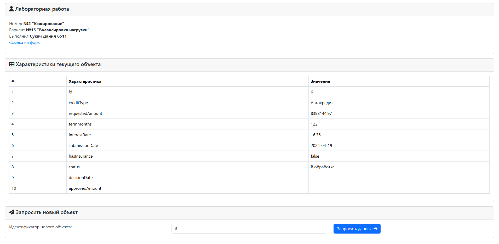

# Лабораторная работа №2

## «Балансировка нагрузки» --- API Gateway с Weighted Round Robin

## Что было сделано

В рамках второй лабораторной работы реализован API Gateway с балансировкой нагрузки между репликами сервиса генерации контрактов.

### 1. Создан API Gateway на базе Ocelot

-   Реализован проект CreditApp.Gateway.
-   Настроена маршрутизация запросов через ocelot.json.
-   Gateway принимает запросы на `/api/Credit` и перенаправляет их на downstream-сервисы.
-   Настроен HTTPS-эндпоинт на порту 7201.

### 2. Реализована балансировка нагрузки Weighted Round Robin

-   Реализован кастомный балансировщик `WeightedRoundRobinBalancer`.
-   Каждая реплика получает количество запросов, пропорциональное её весу.
-   Настроены веса реплик: credit-api-1 = 3, credit-api-2 = 2, credit-api-3 = 1.

### 3. Развёрнуто 3 реплики API-сервиса

-   credit-api-1 (порты 7001/7081)
-   credit-api-2 (порты 7002/7082)
-   credit-api-3 (порты 7003/7083)
-   Все реплики подключены к общему Redis-кэшу.

### 4. Реализована интеграция с Aspire Service Discovery

-   Создано расширение `AspireServiceDiscoveryExtensions` для динамического разрешения адресов downstream-сервисов из переменных окружения Aspire.
-   Адреса реплик переопределяются в конфигурации Ocelot автоматически.

### 7. Оркестрация через .NET Aspire

-   В AppHost настроены 3 реплики API, Gateway и клиент.
-   Настроены зависимости и порядок запуска через `WaitFor`.

## Используемые технологии

-   .NET 8
-   ASP.NET Core Web API
-   Ocelot API Gateway
-   Blazor WebAssembly
-   Bogus
-   Redis
-   IDistributedCache
-   .NET Aspire

## Скриншоты

### Aspire Dashboard

### Web

