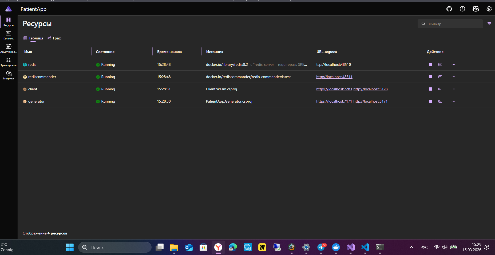
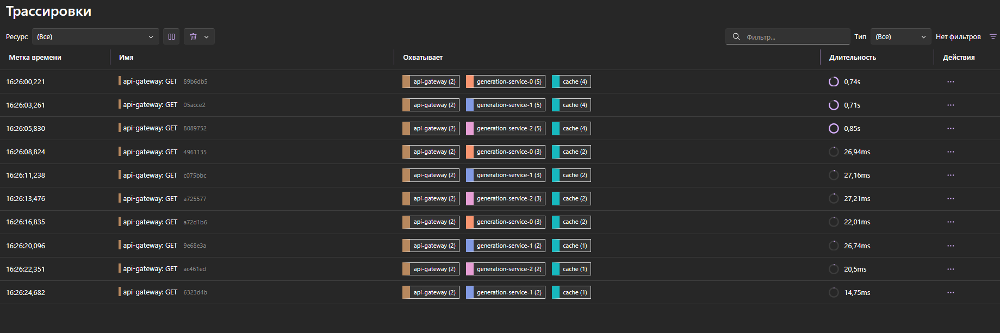
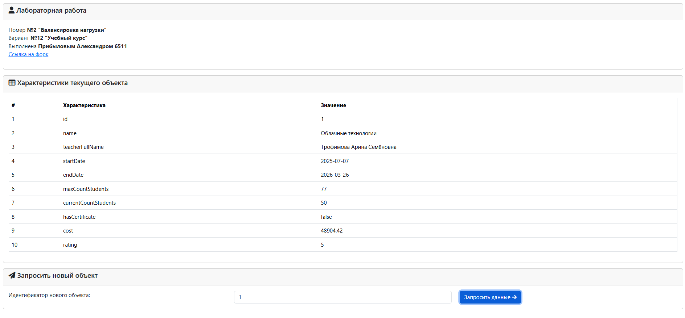
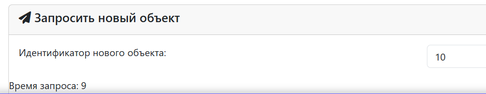
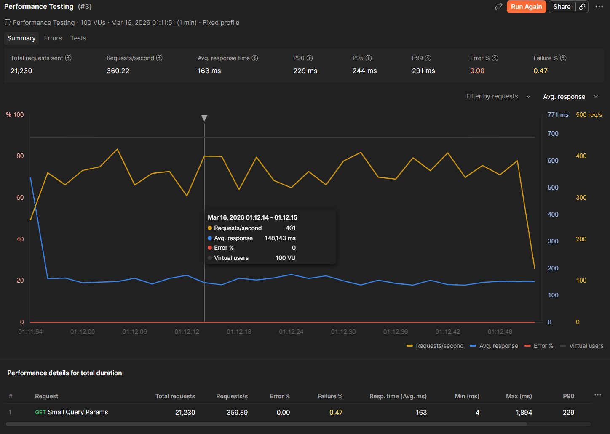

## Цель лабораторной работы №3
Реализация файлового сервиса и объектного хранилища, интеграционное тестирование бекенда.

## Технологии и требования

- .NET 8
- Redis
- Bogus 

### Вариант №12
- **Доменная область**: Учебный курс
- **Алгоритм балансировки**: Query Based
- **Брокер**: SQS
- **Хостинг**: Minio

## Что я сделал в проекте

Реализован API Gateway с кастомным алгоритмом балансировки нагрузки Query Based, который:
- Обеспечивает детерминированное распределение запросов по репликам на основе параметра `id`
- Интегрирован с Aspire для удобной оркестрации и мониторинга
- Поддерживает масштабирование через изменение количества реплик
- Использует Redis для кэширования и уменьшения нагрузки на генерацию данных
- Добавлено объектное хранилище
- Реализована отправка генерируемых данных в файловый сервис посредством брокера
- Реализованы интегрционные тесты

