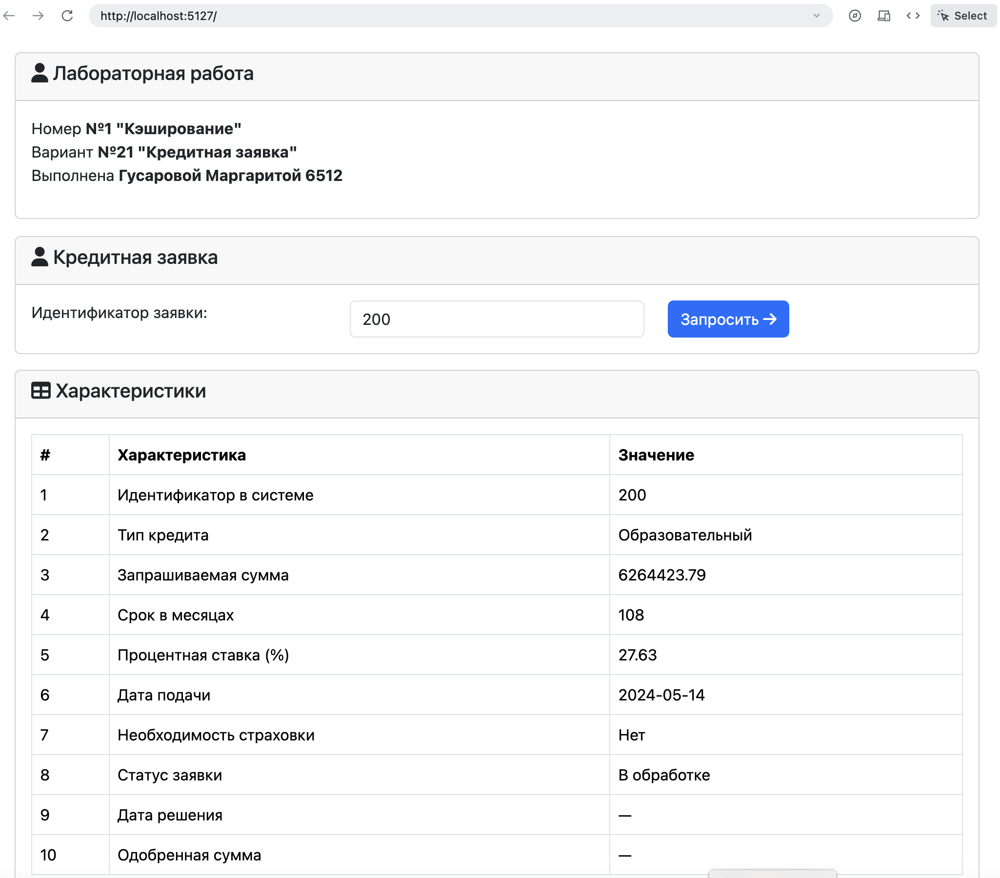

# Лабораторная работа №1 — «Кэширование»

**Вариант:** №21 — «Кредитная заявка»  
**Балансировка:** Weighted Round Robin  
**Брокер:** SQS  
**Хостинг S3:** Minio  
**Выполнил:** Гусарова Маргарита 6512

## Что реализовано

- Генерация сущности «Кредитная заявка» через Bogus.
- Кэширование результатов генерации через IDistributedCache (Redis) с TTL 10 минут.
- Структурное логирование запросов и результатов генерации.
- Оркестрация сервисов через .NET Aspire.
- REST endpoint: `GET /api/creditapplication?id={id}`.
- Дополнительно: реализована клиентская карточка «Кредитная заявка» (Blazor WebAssembly, компонент `Client.Wasm/Components/CreditApplicationCard.razor`) для запроса по ID и наглядного отображения всех полей заявки.

## Характеристики генерируемой заявки

1. Идентификатор в системе — `int`
2. Тип кредита — `string`
3. Запрашиваемая сумма — `decimal`
4. Срок в месяцах — `int`
5. Процентная ставка — `double`
6. Дата подачи — `DateOnly`
7. Необходимость страховки — `bool`
8. Статус заявки — `string`
9. Дата решения — `DateOnly?`
10. Одобренная сумма — `decimal?`

## Правила генерации

- Тип кредита выбирается из справочника: «Потребительский», «Ипотека», «Автокредит», «Рефинансирование», «Образовательный», «Кредитная карта», «Бизнес».
- Процентная ставка не ниже актуальной ставки из конфигурации (`FinanceSettings:MinInterestRatePercent`), округляется до двух знаков.
- Запрашиваемая и одобренная суммы округляются до двух знаков; одобренная ≤ запрашиваемой и заполняется только для статуса «Одобрена».
- Дата подачи не позднее текущей и не более чем 2 года назад.
- Статус выбирается из: «Новая», «В обработке», «Одобрена», «Отклонена».
- Дата решения заполняется только для терминальных статусов («Одобрена», «Отклонена») и позже даты подачи.

## Архитектура и стек

- .NET 8, ASP.NET Core Web API
- Генерация данных: Bogus
- Кэш: IDistributedCache (Redis)
- Оркестрация: .NET Aspire (AppHost поднимает Redis и API)
- Клиент: Blazor WebAssembly + Blazorise (Bootstrap)
- Тесты: xUnit

Структура:
- ProjectApp.Api — API для кредитных заявок
- ProjectApp.Domain — доменные сущности
- ProjectApp.AppHost — оркестрация (.NET Aspire)
- Client.Wasm — веб‑клиент (карточка «Кредитная заявка»)
- ProjectApp.Tests — модульные тесты генератора

## Эндпойнты

- GET `/api/creditapplication?id={id}` — получить или сгенерировать заявку, с кэшированием

## Кэширование

- IDistributedCache (Redis), ключ `credit-application-{id}`
- TTL: `CacheSettings:ExpirationMinutes` (по умолчанию 10 минут)
- При промахе кэша заявка генерируется и сохраняется

## Запуск проекта

Вариант 1 — через Aspire (поднимет Redis и API):

```bash
dotnet run --project ProjectApp.AppHost
```

Вариант 2 — отдельно API и клиент:

```bash
dotnet run --project ProjectApp.Api      # API доступен на http://localhost:5179
dotnet run --project Client.Wasm         # Клиент на http://localhost:5127
```

Проверка тестов:

```bash
dotnet test ProjectApp.Tests/ProjectApp.Tests.csproj
```

## Скриншот карточки 
<p align="center">
  
</p>
