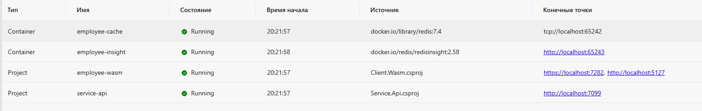
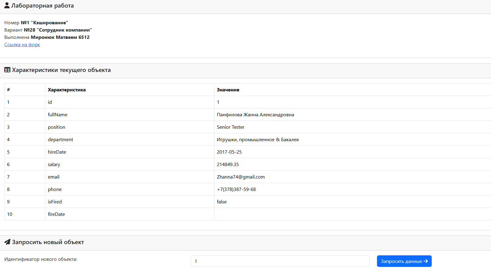
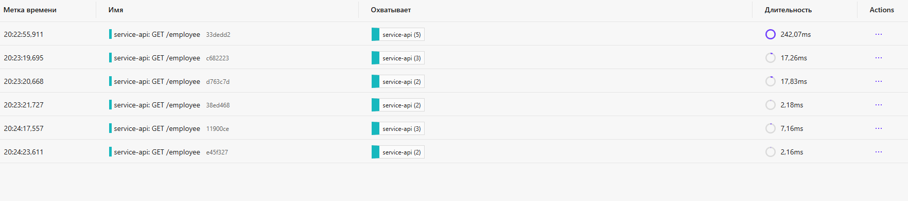

# Современные технологии разработки программного обеспечения
[Таблица с успеваемостью](https://docs.google.com/spreadsheets/d/1an43o-iqlq4V_kDtkr_y7DC221hY9qdhGPrpII27sH8/edit?usp=sharing)

## Задание
### Цель
Реализация проекта микросервисного бекенда.

### Задачи
* Реализация межсервисной коммуникации,
* Изучение работы с брокерами сообщений,
* Изучение архитектурных паттернов,
* Изучение работы со средствами оркестрации на примере .NET Aspire,
* Повторение основ работы с системами контроля версий,
* Интеграционное тестирование.

### Лабораторные работы

1.	«Кэширование» - Реализация сервиса генерации контрактов, кэширование его ответов

  
  
В рамках первой лабораторной работы необходимо:
* Реализовать сервис генерации контрактов на основе Bogus,
* Реализовать кеширование при помощи IDistributedCache и Redis,
* Реализовать структурное логирование сервиса генерации,
* Настроить оркестрацию Aspire. 
  

### Вариант №28
| Доменная область | Балансировка | Брокер | Хостинг S3 |
| --- | --- | --- | --- |
| Сотрудник компании | Weighted Round Robin | SNS | Localstack |

 «Сотрудник компании» 

Необходимо сгенерировать информацию о сотруднике компании со следующими характеристиками:

+----+-------------------------------------------+-------------+
| №  | Название                                  | Тип данных  |
+----+-------------------------------------------+-------------+
| 1  | Идентификатор сотрудника в системе        | int         |
| 2  | ФИО                                       | string      |
| 3  | Должность                                 | string      |
| 4  | Отдел                                     | string      |
| 5  | Дата приема                               | DateOnly    |
| 6  | Оклад                                     | decimal     |
| 7  | Электронная почта                         | string      |
| 8  | Номер телефона                            | string      |
| 9  | Индикатор увольнения                      | bool        |
| 10 | Дата увольнения                           | DateOnly?   |
+----+-------------------------------------------+-------------+

Комментарии к характеристикам:
ФИО - конкатенация фамилии, имени  и отчества через пробел, все из раздела Name
Должность выбирается из двух заранее подготовленных справочников -  справочника профессий (“Developer”, “Manager”, “Analyst” и т.д.) и суффиксов к ним (“Junior”, “Middle”, “Senior” и т.д.)
Отдел берется из раздела Commerce
Дата приема берется не более, чем 10 лет назад от текущей даты
Генерация суммы оклада должна коррелировать с суффиксом должности и не иметь более 2 знаков в дробной части
Электронная почта генерируется из раздела Internet
При отсутствии индикатора увольнения дата увольнения не заполняется
Телефонный номер должен браться из раздела Phone и быть формата +7(***)***-**-**

### Скриншоты

##### Aspire

##### Получение данных

##### Логи  
