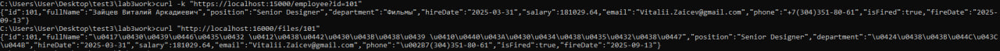

# Современные технологии разработки программного обеспечения

## Лабораторная работа 3
### Интеграционное тестирование — файловый сервис, SNS и объектное хранилище

> Вариант 28: брокер **SNS** и хранилище **S3 LocalStack**. Для надёжной доставки в файловый сервис SNS-топик подписан на SQS-очередь, которую опрашивает `File.Service`.


## Запуск

### Старт приложения

```bash
dotnet restore
dotnet run --project ./AspireApp/AspireApp.AppHost/AspireApp.AppHost.csproj --launch-profile http
```

## Ручная проверка

### 1. Генерация сотрудника

```bash
curl -k "https://localhost:15000/employee?id=101"
```


### 2. Проверка gateway

```bash
curl -k -i "https://localhost:7200/employee?id=101"
```

### 3. Проверка сохранённого файла

```bash
curl "http://localhost:16000/files/101"
```


## Интеграционные тесты

Тестовый проект `Backend.IntegrationTests` поднимает весь backend через `Aspire.Hosting.Testing` и проверяет:

- что `Service.Api` возвращает сотрудника;
- что сотрудник после публикации события появляется в объектном хранилище;
- что повторный запрос по одному и тому же `id` возвращает тот же JSON и файл остаётся доступен.

Запуск:

```bash
dotnet test ./Backend.IntegrationTests/Backend.IntegrationTests.csproj
```

## Ключевые endpoints

- `GET https://localhost:15000/employee?id=1` — прямая генерация через одну реплику сервиса;
- `GET http://localhost:7200/employee?id=1` — запрос через Ocelot gateway;
- `GET http://localhost:16000/files/1` — чтение сохранённого файла сотрудника.